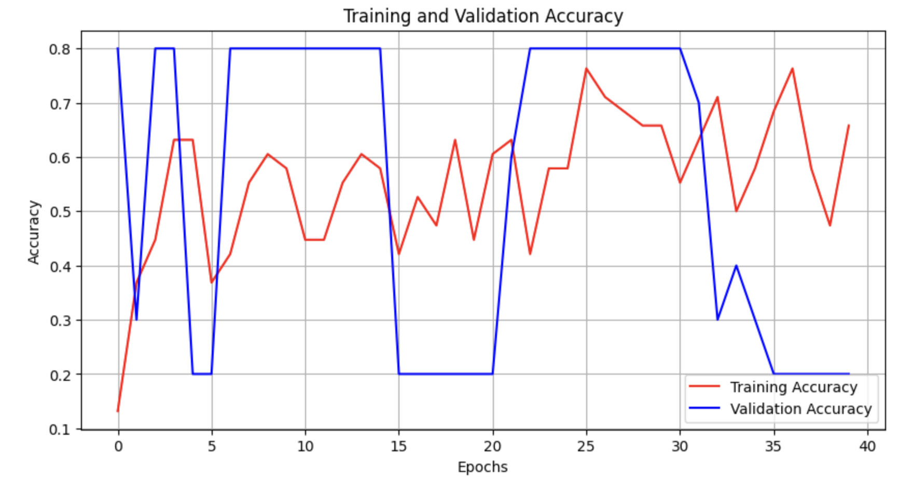

# Pet's Facial Expression Model

This repo contains a simple CNN model that can predict the expression of a pet's face.
The model is trained on the [Pets Facial Expression Dataset](https://www.kaggle.com/datasets/anshtanwar/pets-facial-expression-dataset) from Kaggle. Additionaly, I'm using cv2 to detect the face and resize it to the input shape of the model to increase the accuracy of the model.

## Quick start
```bash
# Tensorflow is not supported by python3.13 yet
python3.12 -m venv venv
. venv/bin/activate

pip install -r requirements.txt

# There is notebook file with the model summary and the data visualization.
./venv/bin/jupyter notebook
# ... and then open CNN Visualization.ipynb file
```

## How to build a model
```
python build_model.py
# You should see created "model.keras" file
```

## How to predict a pet's expression
```
python predict_pet_expression.py <image_filename>
```

## Dataset and model data

#### Categories:


### Training and Validation Accuracy



There is EarlyStopping and ReduceLROnPlateau callbacks used, so on accuracy 0.8 the model stops training.